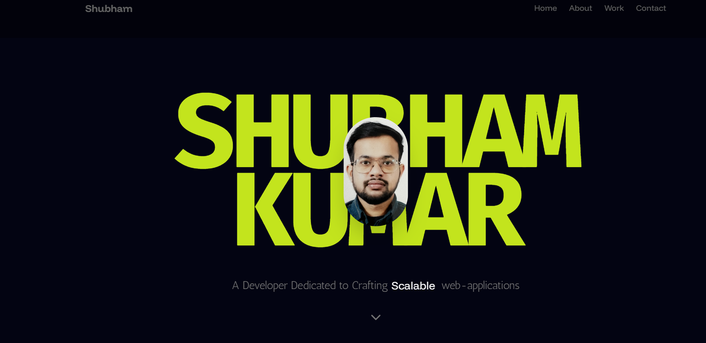

# 🚀 3D Developer Portfolio

A modern, animated 3D developer portfolio built with React, Three.js, TailwindCSS, and motion effects — designed to help you stand out and showcase your skills creatively.



---

## 📚 Table of Contents

- [Features](#-features)
- [Tech Stack](#-tech-stack)
- [Project Structure](#-project-structure)
- [Getting Started](#-getting-started)
- [Available Scripts](#-available-scripts)
- [Customization Guide](#-customization-guide)
- [Troubleshooting](#-troubleshooting)
- [Deployment](#-deployment)
- [Assets](#-assets)
- [Contributing](#-contributing)
- [Contact Me](#-contact-me)
- [License](#-license)

---

## ✨ Features

- 🔥 3D visuals powered by **React Three Fiber** and **Drei**
- ⚡ Smooth transitions and scroll-based animations using **Framer Motion**
- 🎨 Clean, responsive UI with **TailwindCSS**
- 💌 Working contact form using **EmailJS**
- 🧱 Beautiful UI enhancements with **Aceternity UI** and **Magic UI**
- 🚀 Lightning-fast development with **Vite**

---

## 🛠 Tech Stack

| Tech              | Description                           |
|-------------------|---------------------------------------|
| React             | Front-end JavaScript library          |
| Vite              | Fast bundler and dev environment      |
| TailwindCSS       | Utility-first CSS framework           |
| React Three Fiber | 3D rendering with Three.js in React   |
| Drei              | Helpers and abstractions for R3F      |
| Framer Motion     | Animation library for React           |
| EmailJS           | Form handling and email integration   |
| Aceternity UI     | Custom UI components                  |
| Magic UI          | Prebuilt UI elements and design extras|

---

## 📁 Project Structure

```bash
├── public/
│   ├── assets/                    # Images, textures, SVGs
│   │   ├── logos/                # Tech stack logos
│   │   ├── projects/             # Project preview images
│   │   └── socials/              # Social media icons
│   ├── models/                    # 3D .glb files (e.g., Astronaut)
│   └── vite.svg
├── src/
│   ├── assets/                    # Image imports for React
│   ├── components/                # Reusable UI & 3D components
│   │   ├── Card.jsx              # Draggable card component
│   │   ├── Particles.jsx         # Particle effect background
│   │   ├── ProjectDetails.jsx    # Project modal
│   │   └── ...
│   ├── constants/
│   │   └── index.js              # Portfolio data (projects, skills, experiences)
│   ├── sections/                  # Page sections
│   │   ├── Hero.jsx              # Hero section with intro
│   │   ├── About.jsx             # About section with grid layout
│   │   ├── Projects.jsx          # Projects showcase
│   │   ├── Contact.jsx           # Contact form with EmailJS
│   │   ├── Navbar.jsx            # Navigation header
│   │   └── ...
│   ├── App.jsx                    # Main app component
│   ├── index.css                  # Global styles & TailwindCSS config
│   └── main.jsx                   # React entry point
├── .github/
│   └── copilot-instructions.md   # AI agent guidelines
├── tailwind.config.js             # TailwindCSS configuration
├── vite.config.js                 # Vite bundler configuration
├── eslint.config.js               # ESLint rules
└── package.json                   # Dependencies & scripts
```

---

## 🚀 Getting Started

### Prerequisites
- Node.js (v16 or higher)
- npm or yarn package manager

### Installation Steps

1. **Clone the Repository**
```bash
git clone git@github.com:shubhamroy1996/Portfolio.git
cd Portfolio
```

2. **Install Dependencies**
```bash
npm install
```

3. **Run the Development Server**
```bash
npm run dev
```
The app will be available at `http://localhost:5173`

4. **Build for Production**
```bash
npm run build
```

---

## 📝 Available Scripts

| Command | Description |
|---------|-------------|
| `npm run dev` | Start development server with hot reload |
| `npm run build` | Build optimized production bundle |
| `npm run preview` | Preview production build locally |
| `npm run lint` | Run ESLint to check code quality |

---

## 🎨 Customization Guide

### Update Portfolio Content

Edit **`src/constants/index.js`** to add your own:
- **Projects**: Update `myProjects` array
- **Skills**: Add tech stack logos and names
- **Experiences**: Add work history
- **Testimonials**: Add client feedback

```javascript
export const myProjects = [
  {
    id: 1,
    title: "Your Project Title",
    description: "Project description...",
    subDescription: ["Detail 1", "Detail 2"],
    href: "https://project-link.com",
    image: Project.yourImage,
    tags: [
      { id: 1, name: "React", path: Logos.react },
      // Add more tags
    ],
  },
  // Add more projects
];
```

### Customize Theme Colors

Edit **`src/index.css`** in the `@theme` block to change colors:

```css
@theme {
  --color-primary: #030412;      /* Main background */
  --color-royal: #5c33cc;        /* Primary accent */
  --color-lavender: #7a57db;     /* Secondary accent */
  /* Change colors to match your brand */
}
```

### Configure EmailJS

Update credentials in **`src/sections/Contact.jsx`**:

```javascript
await emailjs.send(
  "YOUR_SERVICE_ID",      // Get from EmailJS dashboard
  "YOUR_TEMPLATE_ID",     // Your email template
  {...},
  "YOUR_PUBLIC_KEY"       // Public API key
);
```

[Setup EmailJS](https://www.emailjs.com/docs/) - Free email service for portfolios

### Add Your Personal Info

Update in **`src/sections/Navbar.jsx`** and **`src/constants/index.js`**:
- Your name
- Social media links
- Professional photo
- Bio and description

---

## 🐛 Troubleshooting

### Issue: Form inputs not clickable
**Solution**: This project uses `pointer-events` CSS to manage click handling. Ensure decorative layers have `pointer-events-none` and interactive elements have `pointer-events-auto`.

### Issue: 3D models not loading
**Solution**: Check that 3D `.glb` files are in `public/models/` folder and paths match in component imports.

### Issue: Slow animations
**Solution**: 
- Check browser DevTools Performance tab
- Reduce `quantity` prop in Particles component
- Disable animations on lower-end devices

### Issue: Build errors
**Solution**:
```bash
# Clear cache and reinstall
rm -rf node_modules package-lock.json
npm install
npm run build
```

---

## 🌐 Deployment

### Deploy to Vercel (Recommended)

```bash
# Install Vercel CLI
npm install -g vercel

# Deploy
vercel
```

### Deploy to Netlify

```bash
# Build the project
npm run build

# Upload 'dist' folder to Netlify
```

### Environment Variables

Create a `.env.local` file for sensitive data:

```env
VITE_EMAILJS_SERVICE_ID=your_service_id
VITE_EMAILJS_TEMPLATE_ID=your_template_id
VITE_EMAILJS_PUBLIC_KEY=your_public_key
```

Then update Contact.jsx to use these:

```javascript
await emailjs.send(
  import.meta.env.VITE_EMAILJS_SERVICE_ID,
  import.meta.env.VITE_EMAILJS_TEMPLATE_ID,
  {...},
  import.meta.env.VITE_EMAILJS_PUBLIC_KEY
);
```

---

## � Key Dependencies Explained

| Package | Purpose | Docs |
|---------|---------|------|
| `react` & `react-dom` | UI library | [React Docs](https://react.dev) |
| `vite` | Fast build tool & dev server | [Vite Docs](https://vite.dev) |
| `tailwindcss` | Utility-first CSS framework | [TailwindCSS Docs](https://tailwindcss.com) |
| `motion` & `framer-motion` | Scroll & animation library | [Framer Motion Docs](https://www.framer.com/motion) |
| `three` & `@react-three/fiber` | 3D graphics library | [Three.js Docs](https://threejs.org) |
| `@react-three/drei` | 3D component abstractions | [Drei Docs](https://drei.docs.pmnd.rs) |
| `@emailjs/browser` | Email form handling | [EmailJS Docs](https://www.emailjs.com/docs) |
| `lucide-react` | Icon library | [Lucide Docs](https://lucide.dev) |

---

## 💡 Architecture Highlights

### Animation Strategy
- **Scroll-based**: Uses Intersection Observer + Framer Motion for viewport-triggered animations
- **Spring Physics**: Smooth motion values for 3D elements and parallax effects
- **GPU Accelerated**: CSS transforms and canvas rendering for performance

### Component Patterns
- **Sections**: Full-page layouts in `src/sections/`
- **Reusable Components**: Small UI widgets in `src/components/`
- **Data Centralization**: All portfolio content in `src/constants/index.js`
- **TailwindCSS Only**: No CSS files, all styling via Tailwind classes

### 3D Integration
- 3D models auto-generated by [gltfjsx](https://github.com/pmndrs/gltfjsx)
- Loaded via `useGLTF()` hook from Drei
- Animations handled with `useAnimations()` and Framer Motion

---

## 🔗 Assets

### Download Assets
Assets used in the project can be found [here](https://github.com/user-attachments/files/19820923/public.zip)

### Asset Locations
- **Images**: `public/assets/` and `src/assets/`
- **3D Models**: `public/models/`
- **Icons**: Use `lucide-react` or add to `src/assets/socials/`

---

## 🤝 Contributing

Contributions are welcome! To contribute:

1. Fork the repository
2. Create a feature branch (`git checkout -b feature/amazing-feature`)
3. Commit changes (`git commit -m 'Add amazing feature'`)
4. Push to branch (`git push origin feature/amazing-feature`)
5. Open a Pull Request

---

### Have Questions?
- Open an [Issue](https://github.com/shubhamroy1996/Portfolio/issues) on GitHub
- Check [Copilot Instructions](./.github/copilot-instructions.md) for development guidelines

---

## 📄 License

This project is open source and available under the [MIT License](LICENSE).

---

## 🌟 Show Your Support

If you find this project helpful:
- ⭐ **Star this repository**
- 📢 **Share it with others**
- 📹 **Subscribe** to the [YouTube channel](https://www.youtube.com/channel/UCZhtUWTtk3bGJiMPN9T4HWA)
- 💬 **Give feedback** - what should be built next?

---

## 🎯 Feature Requests

What would you like to see next?
- A beautiful Landing Page
- Complete E-commerce site
- App Clone (YouTube, Netflix, etc.)
- Interactive Portfolio features

Let me know by opening an issue!

